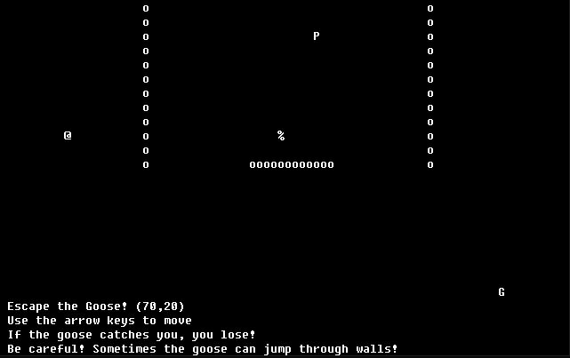

# maze-arcade
A goose escape game created using C++, leveraging functions, arrays and classes. 

This game consists of a player and a goose, both of which were created using classes. The game board was created using a 2D mapping array. My partner and I coded two power-up functions and leveraged built-in C++ functions, like the random number generator. 

This is an image of the game board with the "G" as the goose, the "P" as the player, the "O" as the wall chars and the "%" as the winning location:

